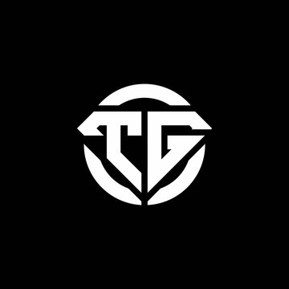

# ToxiGuard:  Empowering Safer Discord Communities (arygupta04 X ohgodimlemon)  <br><br>


ToxiGuard is a Discord bot designed to detect and remove toxic, obscene, insulting, threatening, or identity-hate comments in a group chat. The bot works by monitoring messages and using machine learning models to classify them into one or more of the following categories:

1. **Toxic**
2. **Obscene**
3. **Insult**
4. **Threat**
5. **Identity Hate**

When a message is found to contain harmful content, the bot deletes it and sends a direct message to the user who made the comment, warning them to refrain from making such comments in the future.

## Features

- **Real-time message monitoring**: The bot continuously monitors group chat messages.
- **Multilabel classification**: Uses five separate binary classification models to check for each category (Toxic, Obscene, Insult, Threat, Identity Hate).
- **Automated response**: Deletes messages that violate guidelines and sends a warning to the user.
- **Customizable**: Can be adapted for different Discord servers with minor adjustments.

## Models

~~Each of the five models check for a specific category of harmful content:~~  
~~1. **Toxic**: Identifies toxic language or behavior that promotes hostility or negativity.~~ 
~~2. **Obscene**: Detects obscene or inappropriate language.~~  
~~3. **Insult**: Flags language that insults or demeans others.~~  
~~4. **Threat**: Identifies threats or messages implying harm.~~  
~~5. **Identity Hate**: Detects hate speech based on someone's identity (e.g., race, gender, etc.).~~
~~
EDIT: The model has been retrained, and only uses one model now. This one model performs multilabel classification with high F1 score. This model identifies if the message is **toxic, obscene, insult, threat and identity hate**.
## Installation


### Setup

1. **Clone the repository:**

```bash
git clone https://github.com/arygupta04/ToxiGuard.git
cd ToxiGuard
```

2. **Install dependencies:**

```bash
pip install -r requirements.txt
```

3. **Set up your Discord bot:**

- Create a bot on the [Discord Developer Portal](https://discord.com/developers/applications).
- Copy your bot's token and add it to the `config.json` file.
- To find DISCORD_TOKEN head over to the bot page on the left menu and copy the click on view token, create the token if you have not.
- To find GUILD_ID, right click on the server icon on discord and click on Copy Server ID, this is your GUILD_ID.

```json
{
    "DISCORD_TOKEN": "your-bot-token",
    "GUILD_ID": "your-server-id"
}
```
- Now make a '.env' file in the working directory, and put your discord token there:
```
DISCORD_TOKEN='your discord token without these quotation marks'
```
- On the developers webpage, go to Bot on the left menu and enable all three previledge gateway intents
- Generate a OAuth2 URL: click on OAuth2 on the left menu, under scopes section check bot option, for bot permissions select read message history, sends message, manage message
- Copy the URL at the bottom, and paste it in new tab and authorise the bot in the server you want.

4. **Model Preparation:**

- Make a 'models' folder, and install all the five models from Google Drive [here](https://drive.google.com/drive/folders/1vhM2isy2vIQXGbn9lgH1MKcAyvqElde8).

5. **Get the data:**
- The dataset we are using can be found [here](https://www.kaggle.com/datasets/julian3833/jigsaw-toxic-comment-classification-challenge)
- More specifically, due to abundance of data, we are only using train.csv, to train, validate and test for our models.
- You obviously don't need to train, since models are already trained by us. However, you need the train.csv file in toxicity_wrapper.py to create vectorizer.
- If you face trouble locating this train.csv, edit the path in toxicity_wrapper.py line 21: df = pd.read_csv('jigsaw-toxic-comment-classification-challenge/train.csv').
- Make sure to put this folder in the directory.

5. **Run the bot:**

```bash
python bot.py
```
- The terminal should print: 'bot name' has connected to Discord!

## After following these steps, the bot is ready to be used!
## **How to Use This?**  

1. **Send a Toxic Message**  
   Example: `"You should kill yourself!"`  

2. **Bot Classification (Happens Under the Hood)**  
   For instance, the bot processes the message and classifies it as:  
   - **Toxic**: Yes  
   - **Threat**: Yes  
   - **Obscene**: No  
   - **Insult**: Yes  
   - **Identity Hate**: No  

3. **Bot Action**  
   - **Deletes the Message**: The flagged message is removed from the group chat to maintain a positive environment.  
   - **Notifies the User**: The bot sends a direct message to the user, explaining why their message was flagged. For example:  
     > "Your message was flagged as: 'Toxic', 'Threat', and 'Insult'. Please adhere to the community guidelines and contribute positively to the conversation."  
   - **Neutral or Positive Messages**: Messages that are not flagged as toxic remain unaffected and visible in the chat.  


---
