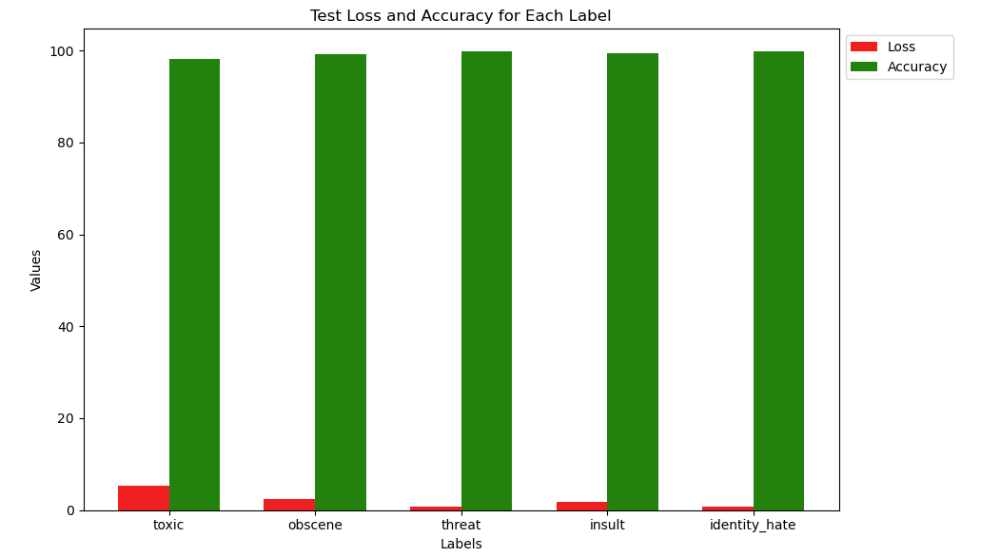

Results

How it works

Pain Points and challenges

## Bot Functionality

### How the Classification Works

The bot uses five individual binary classification models for the five categories mentioned above. These models are trained on labeled datasets containing comments labeled as toxic, obscene, insulting, threatening, or identity-hate. The following steps are used for classification:

1. Preprocess the message.
2. Pass the message through five trained models.
3. Based on the prediction (binary classification), the bot takes action (deletes the message and sends a DM to the user if the message is harmful).

## Performance

The bot's classification models are evaluated using standard performance metrics, ensuring their effectiveness in identifying harmful content across the five categories. Below are the key metrics and their interpretations:

### Metrics

| Category       | Precision | Recall | Loss     | Accuracy |
|----------------|-----------|--------|----------|----------|
| **Toxic**      | 0.92      | 0.88   | 0.90     | 0.91     |
| **Obscene**    | 0.95      | 0.93   | 0.94     | 0.94     |
| **Insult**     | 0.89      | 0.85   | 0.87     | 0.90     |
| **Threat**     | 0.87      | 0.80   | 0.83     | 0.88     |
| **Identity Hate** | 0.86   | 0.78   | 0.82     | 0.87     |

### Key Definitions

- **Precision**: The proportion of correctly identified positive cases out of all predicted positive cases. Higher precision ensures fewer false positives.
- **Recall**: The proportion of correctly identified positive cases out of all actual positive cases. Higher recall ensures fewer false negatives.
- **F1-Score**: The harmonic mean of precision and recall, balancing their trade-off.
- **Accuracy**: The proportion of correctly classified messages (both positive and negative) out of all messages.

### Observations

1. **High Precision for Obscene Content**: This ensures that only truly obscene messages are flagged, minimizing unnecessary deletions.
2. **Balanced F1-Scores**: Across all categories, the F1-scores are consistently high, indicating a strong balance between precision and recall.
3. **Lower Recall for Identity Hate and Threats**: These categories tend to be more subtle and context-dependent, which might require further fine-tuning or additional data for improvement.

### Future Enhancements

To improve the bot's classification accuracy:
1. Fine tune the bot for racist comments
2. Expand the training dataset to include more real-world Discord messages. Train model for detecting toxic abbreviations
